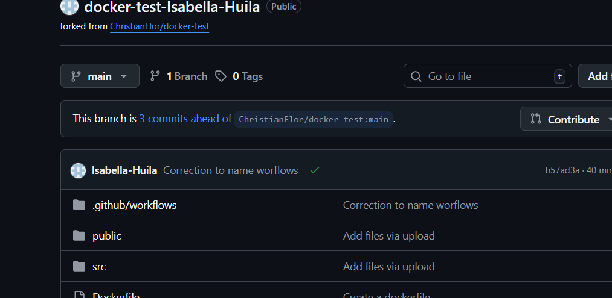
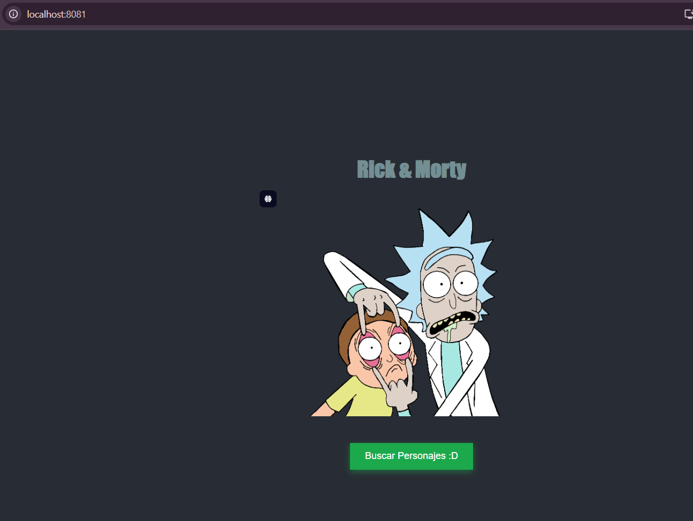
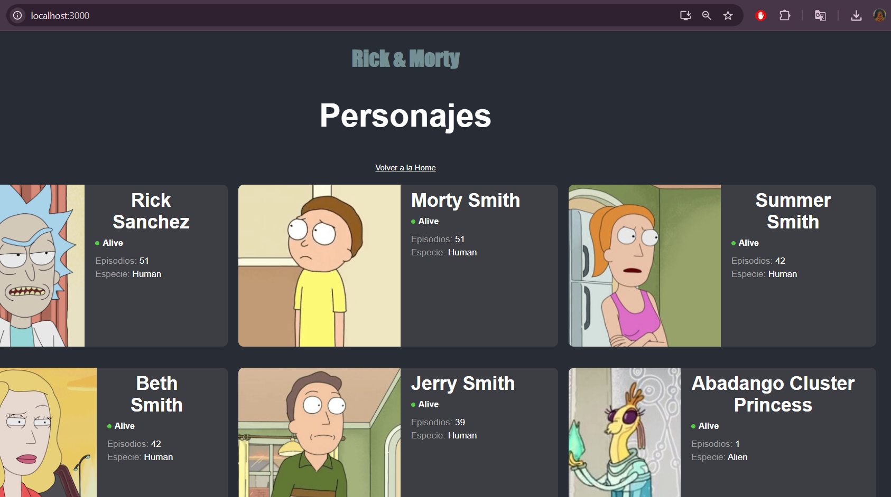

# Proyecto Docker Test

**Nombre:** Isabella Huila Cerón  
**Código:** A00394751  

Este proyecto contiene una aplicación React que fue dockerizada y desplegada usando **Docker** y **GitHub Actions**.

---

## Pasos Realizados

### 1. Fork del Repositorio
Se realizó un **fork** del repositorio original [`docker-test`](https://github.com/ChristianFlor/docker-test) para trabajar de manera independiente.

---

### 2. Creación del Dockerfile
Se construyó un `Dockerfile` multi-stage con **Node.js** y **Nginx**:


```dockerfile
# Etapa de build
FROM node:18-alpine AS builder
WORKDIR /app
COPY package.json package-lock.json* ./
RUN npm install
COPY . .
RUN npm run build

# Etapa final con Nginx
FROM nginx:alpine
WORKDIR /usr/share/nginx/html
COPY --from=builder /app/build .
EXPOSE 80
CMD ["nginx", "-g", "daemon off;"]
````

---

### 3. GitHub Actions

Se configuró un workflow en `.github/workflows/build-and-push.yml` para **construir y publicar la imagen** automáticamente en DockerHub.

Pasos del pipeline:

1. **Checkout** del repositorio.
2. **Set up Docker Buildx**.
3. **Login a DockerHub** usando secretos.
4. **Build & Push** de la imagen.

```yaml
name: Build and Push Docker Image

on:
  push:
    branches: ["main"]
  pull_request:

jobs:
  docker:
    runs-on: ubuntu-latest

    steps:
      - name: Checkout repository
        uses: actions/checkout@v4

      - name: Set up Docker Buildx
        uses: docker/setup-buildx-action@v3

      - name: Log in to DockerHub
        uses: docker/login-action@v3
        with:
          username: ${{ secrets.USER }}
          password: ${{ secrets.PASS }}

      - name: Build and push Docker image
        uses: docker/build-push-action@v6
        with:
          context: .
          push: true
          tags: ${{ secrets.USER }}/docker-test:latest
```

---

### 4. Configuración de Secretos en GitHub

* `USER` → Nombre de usuario en DockerHub.
* `PASS` → Token de acceso generado en DockerHub.

---

### 5. Build Exitoso en GitHub Actions

Se validó que la acción se ejecuta correctamente, construyendo la imagen y subiéndola a DockerHub.



---

### 6. Ejecución con Docker

Se probó la aplicación ejecutando la imagen publicada en DockerHub:

```powershell
docker run -dp 8081:80 --rm isa2210/docker-test:latest
```

Aplicación disponible en: [http://localhost:8081](http://localhost:8081)


---

### 7. Ejecución Local

Para correr la aplicación **sin Docker**:

1. Instalar dependencias:

   ```powershell
   npm i
   ```

2. Levantar servidor de desarrollo:

   ```powershell
   npm run dev
   ```

   Disponible en: [http://localhost:3000](http://localhost:3000)

   

### 8. Estructura del proyecto 

```
docker-test-Isabella-Huila/
├── node_modules/        # Dependencias instaladas con npm
├── public/              # Archivos estáticos (index.html, favicon, etc.)
├── src/                 # Código fuente React
│   ├── components/      # Componentes reutilizables
│   ├── App.js           # Componente principal
│   ├── index.js         # Punto de entrada
│   └── ...
├── Dockerfile           # Definición de la imagen Docker
├── package.json         # Dependencias y scripts del proyecto
├── package-lock.json
└── README.md
````